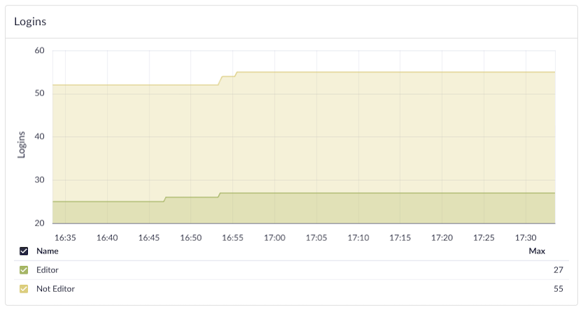
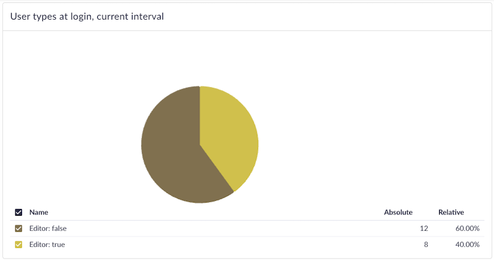
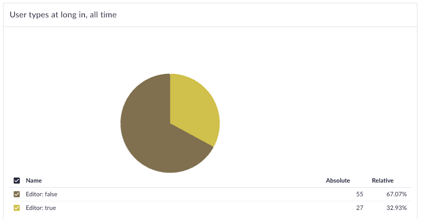

# TYPO3 Telemetry Extension

This TYPO3 extension is a proof of concept for gathering telemetry data ("stats") from participating TYPO3 instances. It currently gathers a single counter metric (logins) by reacting to the corresponding TYPO3 event. This is the companion repo to the Telemetry Report prepared by Neighbourhoodie Software.

To run this, you need:
- A composer-based TYPO3 installation (see below)
- A Prometheus instance as a telemetry receiver and a Perses instance as a dashboard (see report)

## Composer-based TYPO3 intallation

This basically follows the official TYPO3 instructions from here: https://docs.typo3.org/m/typo3/tutorial-getting-started/13.4/en-us/Installation/Install.html#install-quick (complete the entire page, all the way to `ddev composer create "typo3/cms-base-distribution:^13"`).

The entire flow in one go:

```sh
mkdir my_project
cd my_project

ddev config --php-version 8.4 --docroot public --project-type typo3

ddev start

ddev composer create "typo3/cms-base-distribution:^13"

ddev typo3 setup --server-type=other --driver=mysqli --host=db --port=3306 --dbname=db --username=db --password=db
# This will prompt you for a bunch of things, admin username etc.

ddev launch /typo3/
# That should open the backend in your browser.

# Create the default backend user groups, see https://docs.typo3.org/m/typo3/tutorial-getting-started/main/en-us/Administration/BackendUsers/Groups.html#quick-start-auto-create-backend-user-groups-for-editors
ddev typo3 setup:begroups:default -g Both
```

Ideally, now go to https://typo3-composer.ddev.site/typo3/module/system/user-management and set up a user in the "Editor" group, and don’t forget to enable it with right click -> "enable".

Now to install our extension.

```sh
cd packages
# Clone this repo or get it into a subfolder here some other way
git clone git@github.com:neighbourhoodie/typo3-telemetry-extension.git
# Go back into the typo3 root:
cd ..
# Install our extension
ddev composer require neighbourhoodie/telemetry:@dev
# It will ask you to trust 2 plugins, please do so
```

Add `docker-compose.override.yaml` to `.ddev/` with this in it:

```yaml
version: '3.6'
services:
  web:
    environment:
      OTEL_PHP_AUTOLOAD_ENABLED: "true"
      OTEL_RESOURCE_ATTRIBUTES: "service.instance.id=t3-demo"
      OTEL_METRIC_EXPORT_INTERVAL: "10000"
      OTEL_TRACES_EXPORTER: "none"
      OTEL_LOGS_EXPORTER: "none"
      OTEL_METRICS_EXPORTER: "otlp"
      OTEL_EXPORTER_OTLP_METRICS_PROTOCOL: "http/protobuf"
      OTEL_EXPORTER_OTLP_METRICS_ENDPOINT: "http://host.docker.internal:9090/api/v1/otlp/v1/metrics"
      OTEL_PROPAGATORS: "baggage,tracecontext"
      OTEL_SERVICE_NAME: "typo3-demo"
      GS_EXPORTER: "none"
      OTEL_PHP_DETECTORS: "none"

```

This assumes you are running Prometheus with the Docker setup referenced in the report, otherwise replace `OTEL_EXPORTER_OTLP_METRICS_ENDPOINT` with wherever your Prometheus endpoint is.

__Privacy note:__ By default, all SDK resource detectors are used, You have control over these as documented [here](https://opentelemetry.io/docs/languages/php/resources/#disabling-resource-detection). We have opted for maximum anonymity via the env var `OTEL_PHP_DETECTORS: "none"`

__Note:__ `OTEL_METRIC_EXPORT_INTERVAL`: the max is a 32bit integer in milliseconds, which is 2.147.483.647ms, that’s about 27 days.
A *week* would be 604.800.000ms, so `OTEL_METRIC_EXPORT_INTERVAL: "604800000"`.

__Another note:__ The setting of additional resources via env vars seems to be currently unsupported by Prometheus, which is why `OTEL_RESOURCE_ATTRIBUTES: "service.instance.id=t3-demo"` doesn’t have any effect. However, [adding resource attriutes is also possible in code](https://opentelemetry.io/docs/languages/php/resources/#adding-resources-in-code).

Now restart the ddev instance so the new env vars will get picked up, and clear the extension cache.

```sh
ddev restart
ddev exec vendor/bin/typo3 cache:flush
# Whenever you did something to the extension that
# isn’t getting picked up by typo3, flush the cache like this ☝️
```

Now, go to the TYPO3 extension page at https://typo3-composer.ddev.site/typo3/module/tools/extensionmanager
You should see the `telemetry` extension in this list.

To trigger the `loginListener`, log in to the backend as either `admin` or your `editor` user from the initial setup step.

## Logs

The extension will by default log to `/public/var/log/telemetry.log` if you use the logger as shown in `/packages/telemetry/Classes/EventListener/LoginListener.php` and `/packages/telemetry/Classes/Service/TelemetryService.php`.  

To see regular php logs (`error_log("argh")`) in Docker:

```sh
docker logs ddev-typo3-composer-web -f
# If the container name is wrong, look for a web container with `docker ps`
# Alternatively, use docker desktop, containers -> unfold `ddev-typo3-composer`
# -> click on `web`, should show you logs. 
```

## Usage in Prometheus/Perses

This is a brief overview, more detail is available in the report.

In a Perses graph, you should be able to query the basic login metric with `login_total`.

You can have two graphed lines, one for editors and one for non-editors, with

```sql
sum by (isEditor) (sum_over_time(login_total[100y]))
```

This shows all logins ever. For more customisation options such as labels and line colors, run two separate queries in one graph and style them individually:

```sql
sum(sum_over_time(login_total{isEditor="true"}[100y]))
sum(sum_over_time(login_total{isEditor="false"}[100y]))
```
Which would give you:



If you would like to display the *totals for the currently selected interval* (last 30min, last 2 weeks etc.) as a single number, for example in a pie chart, use
```sql
sum by (isEditor) (sum_over_time(login_total[$__rate_interval]))
```
and set the chart `calculation` to `sum` in the chart settings (this is true whenever you’re using `$__rate_interval`). `$__rate_interval` is the Prometheus variable for the current interval for use in over time-calculations.

Result:


If you would like to display the *totals for all time* in a pie chart, use
```sql
sum by (isEditor) (sum_over_time(login_total[100y]))
```
and _leave_ the chart `calculation` on `last *` in the chart settings. 



### Inspecting the Telemetry Metadata in the TSDB

In Prometheus (not Perses), you can get all recorded data with the Prometheus query `{__name__!=""}[10s]`, this logs the last 10s of EVERYTHING that happened in Prometheus. This is likely to crash your browser if set to a longer timespan. Use with caution.

The relevant metadata for each request is in a `target_info` record. Get those with:

```
{__name__="target_info"}[1h]
```

Result (not actually JSON):
```json
{
  "host.arch": "aarch64",
  "host.id": "903e0da8de3d4534951bc52243769d05",
  "host.name": "typo3-composer-web",
  "instance": "f007f655-f66d-4da5-b45c-060426abd4a9",
  "job": "typo3-demo",
  "os.description": "6.10.14-linuxkit",
  "os.name": "Linux",
  "os.type": "linux",
  "os.version": "#1 SMP Thu Aug 14 19:26:13 UTC 2025",
  "process.executable.path": "/usr/sbin/php-fpm8.4",
  "process.owner": "espy",
  "process.pid": "1649",
  "process.runtime.name": "fpm-fcgi",
  "process.runtime.version": "8.4.10",
  "service.instance.id": "f007f655-f66d-4da5-b45c-060426abd4a9",
  "service.name": "typo3-demo",
  "telemetry.sdk.language": "php",
  "telemetry.sdk.name": "opentelemetry",
  "telemetry.sdk.version": "1.7.0"
}
```

As written above, you have control over these as documented [here](https://opentelemetry.io/docs/languages/php/resources/#disabling-resource-detection). Since we set `OTEL_PHP_DETECTORS: "none"`, we only get something like:

```json
{
  "instance": "7d9bb8d8-435f-4dac-9b59-98e636d82d7d",
  "job": "typo3-demo",
  "service.instance.id": "7d9bb8d8-435f-4dac-9b59-98e636d82d7d",
  "service.name": "typo3-demo",
  "telemetry.sdk.language": "php",
  "telemetry.sdk.name": "opentelemetry",
  "telemetry.sdk.version": "1.7.0"
}
```
